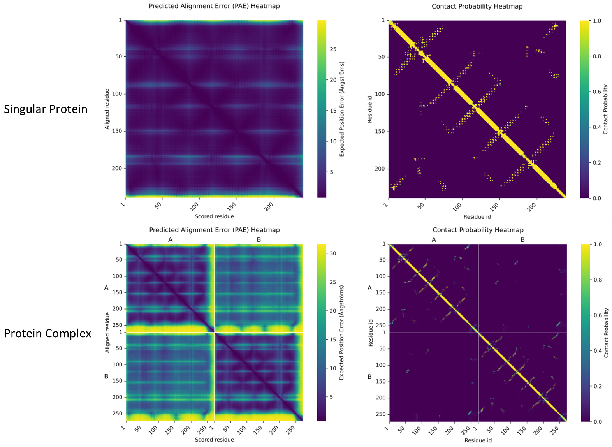

# AlphaFold3 Output Plotting

This tool produces two heatmaps and reports the **predicted TM-score (pTM)** and **inter-chain predicted TM-score (ipTM)**.

**“Results Preview”**


## Getting started / installation

To get started using the tool, clone the repo:

```
git clone https://github.com/Sir-Corgi/AlphaFold3_Output_Plotting.git
```

### Requirements

Make sure you have Python ≥ 3.9 and the following packages installed:
```
pip install numpy pandas matplotlib seaborn
```

## Usage

Basic usage:
```
python alphafold3_analysis.py /path/to/protein_X_ --prefix protein_X_
```
Command-Line Options:
| Argument        | Type | Default | Description |
|-----------------|------|----------|--------------|
| `folder`        | str  | —        | Path to the folder containing AlphaFold 3 output files |
| `--prefix`      | str  | —        | Prefix for input files (e.g., `protein_X_` for files like `protein_X_confidences.json`) |
| `--tickspacing` | int  | auto     | Spacing between tick marks on heatmap axes |
| `--showplot`    | flag | `False`  | Display plots interactively instead of saving them |
| `--reres`       | flag | `False`  | Restart residue numbering for each chain |

- Add example with multiple options combined:

```bash
python alphafold3_analysis.py /path/to/protein_X_ --prefix protein_X_ --tickspacing 50 --reres --showplot
```

## Citation

> [!IMPORTANT]  
> If you use this tool or any figures generated by it in your work, please cite this repository:
> Jesper Buis. (2025). **Alphafold3 Output Plotting**. GitHub repository.
https://github.com/Sir-Corgi/AlphaFold3_Output_Plotting

---
## Additional Information

### pTM & ipTM

- **pTM** — a measure of structural similarity between two protein structures, normalised for protein length. AF3 predicts this by estimating the value of the predicted structure compared to the (unknown) true structure.  
- **ipTM** — used for multi-chain proteins/complexes; evaluates confidence in the relative positioning of chains to each other.

### Predicted Alignment Error (PAE) Heatmap

The PAE heatmap displays the expected positional error of each residue relative to every other residue in the predicted structure.

For residue pair `(i, j)`, `PAE[i][j]` represents the uncertainty in the position of residue `i` assuming residue `j` is perfectly placed. This helps identify regions of high relative positional uncertainty between residues.

### Contact Probability Heatmap

AF3's neural network outputs vectors called **logits**. Each logit corresponds to a distance **bin** (a defined range of distances). Applying the **softmax** function to these logits converts them into a probability distribution over the bins.

The contact probability between residues `i` and `j` is computed as the sum of the probabilities of all bins that correspond to distances `≤ 8 Å`. These contact probability values are plotted in a heatmap to visualise probable residue–residue contacts.

#### Mathematical definition

\le8\text{\AA})=\sum_{d\le8\text{\AA}}P(d))

> [!NOTE]  
> (Here `P(d)` is the probability assigned by the softmax over logits for a given distance bin. Bins are defined by AF3's output discretisation of distances.)

## References
- Jumper, J., Evans, R., Pritzel, A., Green, T., Figurnov, M., Ronneberger, O., Tunyasuvunakool, K., Bates, R., Žídek, A., Potapenko, A., Bridgland, A., Meyer, C., Kohl, S. A. A., Ballard, A. J., Cowie, A., Romera‑Paredes, B., Nikolov, S., Jain, R., … Hassabis, D. (2021). Highly accurate protein structure prediction with AlphaFold. Nature, 596(7873), 583–589. [DOI](https://doi.org/10.1038/s41586-020-03049-3)
- Abramson, J., Adler, J., Dunger, J., Evans, R., Green, T., Pritzel, A., Ronneberger, O., Willmore, L., Ballard, A. J., Bambrick, J., Bodenstein, S. W., Evans, D. A., Hung, C.‑C., O’Neill, M., Reiman, D., Tunyasuvunakool, K., Wu, Z., Žemgulytė, A., Arvaniti, E., … Jumper, J. M. (2024). Accurate structure prediction of biomolecular interactions with AlphaFold 3. Nature, 630(8016), 493–500. [DOI](https://doi.org/10.1038/s41586-024-07487-w)
